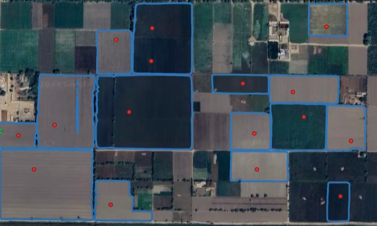

# Enhancing Agricultural Precision and Land Management through Geo-Conversion: From Points to Polygons in Bahawalnagar, Pakistan

In the region of Bahawalnagar, Pakistan, a significant geospatial initiative unfolds. The objective is to advance agricultural precision and land management through the conversion of point data to respective polygons for crop areas to enable data analytics and predictions.



# Project Overview

At its core, this project aims to replace individual data points with polygons, creating a more comprehensive representation of farm lands. Over **18,000 meticulously placed data** points serve as the foundation. These points correspond to **Kharif crops for the tenure of 2023 - 2024**, including maize, rice, fodder, cotton, and sugarcane. Our endeavor is to annotate farmlands with these specific crop types, painting a clearer picture of the landscape.

# Challenges and Significance

The essence of this endeavor lies in the transformation — converting isolated points into enclosed polygons. This shift enables us to precisely define farm boundaries and crop areas. This conversion holds the potential to considerably improve **monitoring, planning, and resource allocation** practices in agriculture.

# Benefits and Applications

The implications of this transformation are far-reaching. By representing farm lands as polygons, the project equips farmers, land managers, and policymakers with comprehensive insights for decision-making. The newfound polygons become invaluable tools for crop analysis, yield prediction, resource optimization, and strategic land-use planning.

# Methodology Overview
The project methodology unfolds in a structured sequence, commencing with the import of initial point data into QGIS. This initial step enhances spatial understanding and visualization. The subsequent phase involves extracting vital information, including bounding box extents and precise latitude-longitude coordinates, from QGIS. This organized data is compiled in a CSV file, forming the foundation for the Geo Segmentation model's input. Utilizing the provided Colab code, this CSV input undergoes processing to generate masks, which are encapsulated within GeoPackage files.

With the computational phase completed, these GeoPackage files are imported back into QGIS. Within this environment, the files are subjected to meticulous post-processing, enabling spatial analysis, visualization, and effective spatial data management. This synergy between QGIS and the Geo Segmentation model effectively converts point data into intricate farm polygons, culminating in a cohesive geospatial analysis workflow.

# Tools and Libraries
## Segment-Geospatial Library: **Elevating Geospatial Analysis**

The segment-geospatial library is a powerful toolkit designed to enhance geospatial analysis projects. With a focus on segmentation tasks, this library provides versatile modules and functions to uncover hidden patterns within spatial data.

**Key Features:**

- **Image Segmentation:** 
- **Vector Data Segmentation:** 
- **Spatial Clustering:**
- **Machine Learning Integration:** 
- **Geospatial Analysis:** 


## QGIS: Tool for Geospatial Data Handling

Utilizing the power of the QGIS tool, this project explores new horizons in geospatial analysis. QGIS offers a flexible and versatile environment for handling geospatial data. Some of the perks of using QGIS include:

- **User-Friendly Interface:**
- **Extensive Plugin Ecosystem:**
- **Spatial Analysis:** 
- **Support for Various Data Formats:**
- **Open Source and Community-Driven:**

<br/>

# Methodology: Step-by-Step

Given below is a step-by-step procedure for converting data points to polygons for their respective areas or objects. You may also watch the video tutorial through the following link: [Point Data into polygon shapes using Segment-geospatial model.](https://www.youtube.com/watch?v=WBIuUh_oYzg&ab_channel=MYSTERIOUS) 

## Adding Initial Data Points in QGIS

At the start of our project, we had a collection of data points that indicated the locations of different farms and the types of crops. To handle this data effectively, we utilized QGIS. 

 In QGIS, we created a **dedicated layer** specifically for our data points. Each point represented the location of a farm, and we attached information about the crop type to each point. Clear understanding of how the farms were distributed across the area was obtained.

This tool facilitated the organization and visualization of our data, enabling us to work with the information more effectively. This initial phase marked the commencement of the process of converting mere points into meaningful farm shapes.


## Obtaining Data for Geo Segmentation Model

Once you've visualized the points on the map using QGIS, the next step is to gather crucial data for the Geo Segmentation model. This data includes:

### 1. Obtaining the Extent (Bounding Box)

- Zoom to the Appropriate Area: In QGIS, zoom to an area that covers the points and farm locations. This ensures the map holds all the relevant details for processing.

- Set the Coordinate Reference System (CRS): Go to the QGIS project's settings and select the suitable Coordinate Reference System. This ensures accurate spatial data representation.


- Copy the Extent: At the bottom panel of the QGIS interface, find the extent information and copy it. This value defines the bounding box for upcoming processes.


---
#### *Note: Adjusting Bounding Box Extent for CSV Entry*

*When copying the extent of the bounding box from QGIS, ensure to make specific adjustments for CSV entry:*

*1. **Remove Degree Symbol:** After copying the extent, remove any ° (degree) symbols present in the coordinates.*

*2. **Replace ":" with "," :** In the copied extent, replace any colons (:) with commas (,). This change ensures that the coordinates are suitable for segmentation model.*

*By following these adjustments, you'll have the extent of the bounding box formatted appropriately for CSV entry, ready to be used in your geospatial analysis.*

---

### 2. Accessing Latitude and Longitude

To extract the latitude and longitude data:

1. **Open the Attribute Table:** Begin by opening the attribute table of the layer that contains the point data.

2. **Utilize Field Calculator:** Employ the field calculator tool to generate two new virtual fields – one for Longitude and another for Latitude.
    
    - **For Longitude:** Create a virtual field named "Longitude" with the output field type set to "Decimal" and Utilize the expression 
    
    ``` 
    x($geometry)
    ```
    

    - **For Latitude:** Craft another field named "Latitude" with the same output field type. Apply the expression 
    ```
    y($geometry)
    ```
    
    
    
Through these steps, you successfully acquire the essential information – the bounding box extent and the latitude and longitude coordinates of each point. This collected data forms the cornerstone for the input required by the Geo Segmentation model, propelling you forward with your geospatial analysis endeavors.

### 3. Organizing Data in Excel Sheet

Following the QGIS steps, the next stride involves organizing the data in an Excel sheet:

1. **Copying Points from QGIS:** Transfer the points you've worked with in QGIS and paste them into an Excel sheet.

2. **Selecting Specific Columns:** Keep only the columns containing latitudes and longitudes.

3. **Adding Bounding Box Extent:** Introduce a new column for the extent of the bounding box associated with each point.

4. **Save in CSV Format:** After completing the modifications, save the Excel file in CSV format.


By following these adjustments, you'll have the extent of the bounding box formatted appropriately for CSV entry, ready to be used in your geospatial analysis.
#### *Note : In case of points available in another bounding box, just change the coordinates in box_cords column. Points from Multiple bboxes can also be processed simultaneously.* 


## Working with Colab
1. Open your Colab notebook and navigate to the file browser on the left-hand side.

2. Locate the "content" directory within the Colab notebook.

3. Click the "Upload" button and select the CSV file from your local computer. The file will now be uploaded to the "content" directory in the Colab notebook.

2. Follow the instructions within the notebook to execute the provided code cells. This code will utilize the CSV file you've uploaded and generate masks based on the provided Colab code.

---

#### *Important Note: To ensure efficient processing in the provided Colab notebook, switch the runtime to T4. This grants access to the Colab GPU, significantly enhancing computation speed and overall performance.* 

---

<br>


## Post-Processing in QGIS: Importing GeoPackage Files
Once the data has been successfully processed in the Colab environment, the generated GeoPackage files containing the mask information will be downloaded to your designated download directory.

### Further Processing in QGIS
Further Processing: With the imported layer in QGIS, you can perform various spatial analysis, visualization, and shapefile management tasks as needed for your project. Following are the basic steps for further processing:

1. **Removing Unnecessary Features (Masks):** Upon importing the layer, review and remove any unnecessary polygon shape features by deleting them. This streamlines the dataset for more focused analysis.

2. **Dissolving Overlapping Features:** Open the Processing Toolbox in QGIS and use the Dissolve tool. This process merges overlapping features, making them easier to manage. 

    ***Note: Make sure to check the option to keep disjoint features separate.***

3. **Managing Dissolved Layer:** After applying the dissolve, a temporary dissolved layer is formed. You have the choice to either save this layer permanently or copy only the required shape features to your collective layer. In our project, we opted to extract features for separate crop types into distinct layers.

These steps optimize the management of your geospatial data for saving accurate mask polygons.

<br>

# Conclusion
In the Geo-Conversion project, point data underwent a significant transformation into detailed polygons for improved agricultural precision in Bahawalnagar, Pakistan. The initiative aimed to replace isolated points with comprehensive polygons, benefiting crop cultivation understanding and management.

This shift held the potential to revolutionize monitoring, planning, and resource allocation in agriculture. By leveraging tools like QGIS for visualization and data extraction, the project obtained crucial information such as bounding box extents and coordinates. The collected data formed the basis for the Geo Segmentation model, generating masks in GeoPackage files.

Post-processing in QGIS enabled further spatial analysis and data management. The project showcased the capabilities of the Segment-Geospatial Library, emphasizing image and vector data segmentation, spatial clustering, machine learning integration, and geospatial analysis.

Moreover, this innovative methodology is not limited to agricultural applications alone. The process of converting point data to polygons can be applied across diverse fields, including urban planning, architecture, environmental studies, and more. 

Ultimately, the Geo-Conversion project exemplified the fusion of technology and agriculture, leading to informed land management and enhanced farming practices through the transformation of point data into detailed farm polygons.


# Contributors

- Shameer Ashraf - shameerisb@gmail.com
- Bostan Khan - bostankhan6@gmail.com
- Muhammad Salman - makhtar.phdcs22seecs@seecs.edu.pk

# Acknowledgements

We extend our heartfelt gratitude to the creators and contributors of the segmentation geospatial model available at https://samgeo.gishub.org/. This invaluable resource played a pivotal role in our project, enabling us to achieve accurate and detailed segmentation of geospatial data.
